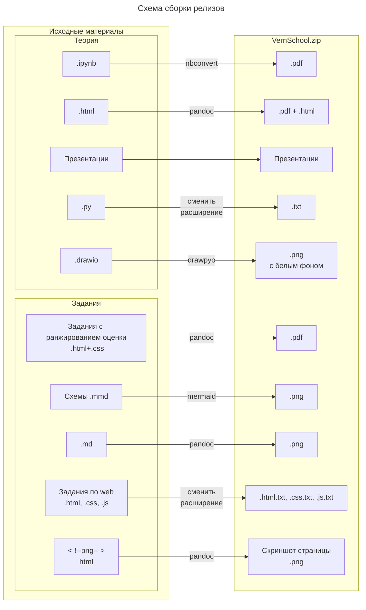

# Программирование
Материалы для школьников

.ipynb - файлы Jupyter Notebook ([Подробнее](https://jupyter.org/install#jupyter-notebook))  
.py - файлы Python  
.drawio - файлы с схемами draw.io ([Подробнее](https://www.drawio.com/))

[JN.bat](JN.bat) - исполняемый файл для запуск Jupyter Notebook на Windows  
[JN.sh](JN.sh) - исполняемый файл для запуск Jupyter Notebook на Linux

При сборке расширение меняется на .txt, потому что MЭШ не дает загружать другие файлы

